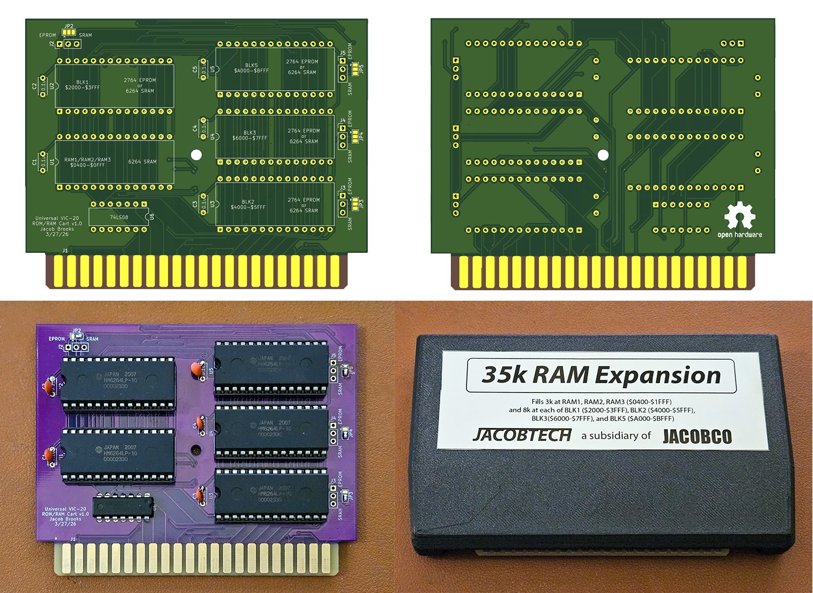
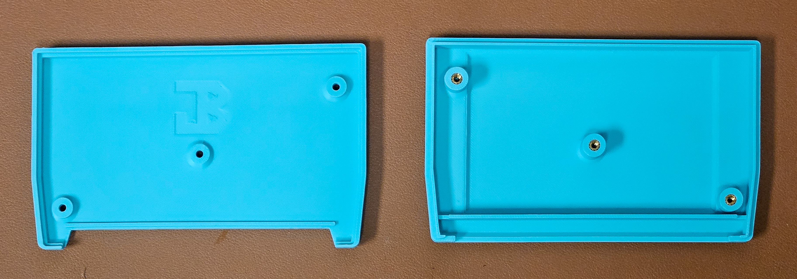

# VIC-20_ROMRAMCart
**Universal ROM/RAM Cartridge for the Commodore VIC-20**

Though there are many existing open-source board designs for Commodore VIC-20 ROM or RAM expansion cartridges, I wanted one that could function either as a ROM program cartridge, a customizable RAM expansion cartridge, or as any combination of those things. Many on-demand PCB manufacturers require you to order 5 or more boards at a time; this design allows me to order the same PCB for all of the cartridge types I want to make. I am aware that this is not the simplest or cheapest way to do this, it just happens to be the solution that fulfilled my requirements. 

STL files for a 3D-printable cartridge enclosure are included here, curteousy of my amazing partner.

Of course, this design comes with no guarantees of any sort. I can confirm that the PCBs have been tested and work in my 1983 NTSC VIC-20 and expect that there would be no issues in a PAL system. If anyone finds problems with this design, please let me know or open an issue.

Overview
--

This board can fill BLK1, BLK2, BLK3, and BLK5 with either a 2764 8k EPROM or a 6264 8k SRAM chip. This way, ROM and RAM can be mixed/matched/inserted wherever is necessary for the cartridge. A 6264 SRAM chip can be used along with a 74LS08 IC to fill RAM1, RAM2, and RAM3 blocks to form a 3k expansion. In this configuration, the remaining 5k of the SRAM chip is left unused. This board, therefore, can be populated to be:

- A 3k, 8k, 16k, 24k, 32k, or 35k RAM expansion cartridge
- An 8k, 16k, 24k, or 32k ROM cartridge
- A cartridge containing some combination of ROM/RAM

Details in the section below.

Configurations
--
In the VIC-20, the BLK1, BLK2, BLK3, BLK5, and 3k ram area can be thought of as operating independently of one another. This means that, with the exception of the 3k RAM area, either RAM or ROM can be placed in any of these positions. As far as I am aware, the 3k RAM area (RAM1, RAM2, RAM3) is designed to only contain RAM. It is possible, therefore, to set a cartridge up in a variety of different configurations. This PCB is designed to support them all. 

For those who want to be able to re-configure the board with ease, pads are provided for typical 0.1-inch-pitch pin headers to be used with removable jumpers. The ICs can be socketed for easy swapping. If the board is to be set in a permanent configuration, solder bridge pads are also provided. 

- **35k RAM expansion configuration**: 
  - To populate all available addresses with RAM, install 6264 SRAM ICs in all 32-pin IC positions
  - The 3k RAM area also requires the 74LS08 IC to be populated
  - All solder bridges/jumpers need to be set to the SRAM position
- **8k/16k/32k ROM cartridge configuration** 
  - ROM images are usually designed to be available at a particular address. It is therefore important that you install the EPROMs in the position required. 
  - The 3k RAM area is unused in this configuration. The 74LS08 IC can be omitted. 
  - Solder bridges/jumpers must be set to the EPROM position
- **Some other combination of ROM/RAM**
  - Some cartridges are designed to contain both ROM and RAM. For example, the VIC-1211A Super Expander cartridge contained BASIC extensions as well as 3k of RAM expansion. I believe that some assembler cartridges worked in the same way.
  - If you need the 3k RAM expansion, install the 6264 SRAM chip and the 74LS08. If you don't need it then don't install it.
  - Install 2764 EPROM or 6264 SRAM ICs in whatever positions are required and be sure to set the solder bridges/jumpers to the appropriate position.
 
**NOTE**: The VIC-20 won't report all of a 35k RAM cartridge in "BYTES FREE" at the top of the screen. When the system sees RAM in BLK1/2/3/5, BASIC seems to assume that there is none in the 3k area. 

PCB Manufacturing
--
Gerber files are included in the Kicad directory. For best long-term performance, I recommend ENIG coating for the edge connector fingers; solder alone will oxidize over time and will likely need cleaning eventually. I also recommend that the PCBs are 1.6mm thick, though there is likely some wiggle room here.

It is important that the PCB edge connector is beveled. I ordered the boards with a 45-degree bevels, though you could do this with a file if you want to save a tiny bit of money. Boards without bevels could damage the fingers in the motherboard edge connector, so please don't skip this step.

3D-printed case
--

As mentioned before, my amazing partner designed a 3D-printable case suitable for protecting the boards in this repo. It is important to note that this enclosure will ***not*** fit normal VIC-20 cartridge PCBs without modification.

Each case will require:
- 1x print of the top cover
- 1x print of the bottom cover
- 3x M3 heat set inserts
- 3x M3x8mm countersink machine screws

Depending on your printer tolerances, you may need to pad the top PCB edge with a bit of tape to prevent the board from rotating about the center screw. I have printed this case on two printers, one needed no padding and the other needed ~1mm of tape thickness. The case top has a deep cutout to accommodate tall EPROMs in sockets. You should be able to use any standard size IC.

I use a soldering iron to install the heat set inserts. Be gentile and wait until the inserts fully cool before trying to assemble the cartridge. Though I know that we are all super excited to play our games, we must exercise a little patience here.

License
--
This work is licensed under a [Creative Commons Attribution-ShareAlike 4.0 International License](https://creativecommons.org/licenses/by-sa/4.0/). 

This design utilizes the VIC-20 expansion port edge connector footprint from [https://github.com/hackup/HackupNet-KiCad-Libraries](https://github.com/hackup/HackupNet-KiCad-Libraries), also distributed under the same license. 
